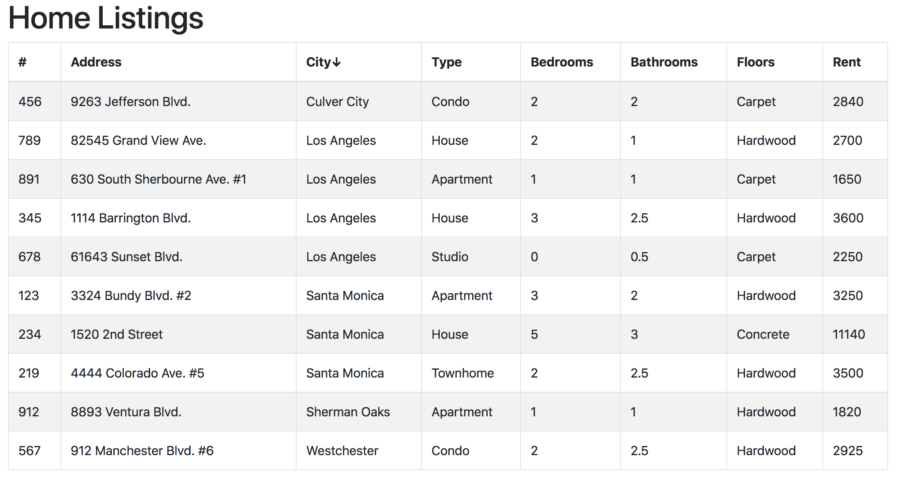

# Homes Listing (React)

You've been tasked with building an interactive table displaying a list of homes for rent in the L.A. area. Clicking on any of the table column headings should sort the table rows by that heading's field name, in ascending order. Clicking on the same heading should re-sort the table rows by the same field name, but flip the sorting to descending order. When you're finished, you should have a working app that looks like:

**Tips to get started**:

- See `/src/homeData.json` for reference on the structure of data you are given.

- See `/src/App.js` for an example of creating html tables, utilizing the `reactstrap` `<Table />` component.

- Check out the initial <App /> state for a hint on how to proceed with the sorting portion of this exercise.

- The HTML symbol for an up arrow &uarr; is `&uarr;`. Down arrow &darr; is `&darr;`

  ​